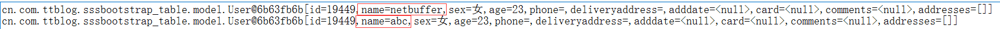
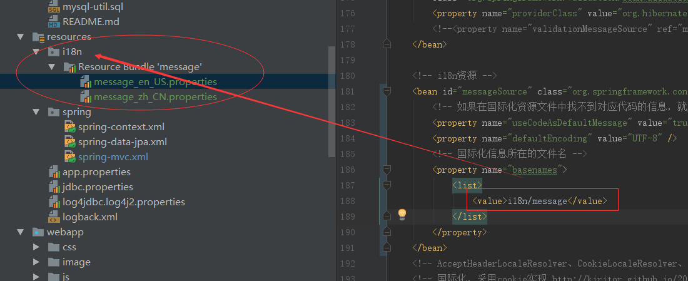

### 备注
* `FileUploadController`-文件上传测试，包括`jquery.fileupload`的使用
* `JsonpController`-测试jsonp使用，spring-jsonp库的使用，原理就是通过`HttpServletResponseWrapper`修改响应  
* `ApiController`-@RestController注解测试，编写http接口使用很方便，开发restful接口好用  
* `GlobalExceptionController`-全局异常捕获处理  
* `TestController`-一些乱七八糟的测试...  
* `MySpringTextWsHandler`spring-websocket测试  
* `UserController`测试数据获取、json/pdf/excel视图  
* `@RequestMapping`支持ant风格url匹配的模式，* ?  
* `@RequestHeader`、`@RequestCookie`   
*   
`@ModelAttribute`从数据库先查询出bean，再组装前端传递的参数到controller中的方法入参
* 
i18n国际化消息展示

---
#### JPQL(java持久化查询语言)使用整理
##### jpql操作的是对象和属性，sql操作的是表和字段
> 运算符`:`+ - *  / ; = > < >= <= <> between like in is null is empty member of not and or  
> 内置函数`:`concat substring trim upper lower length locate ;日期函数CURRENT_DATE CURRENT_TIME CURRENT_TIMESTAMP
数学函数:ABS SORT MOD SIZE;聚合函数:avg sum count min max  
> `where... group by ... having... order by `

> 使用idea编译工程需要在maven pom.xml中配置打包xml/properties资源,默认idea不打包,eclipse会打包